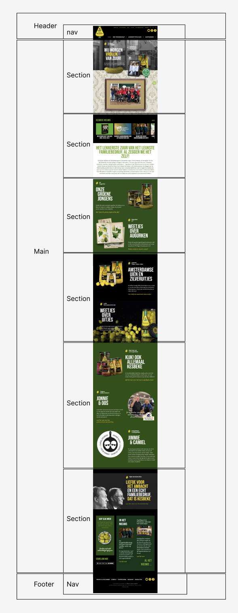
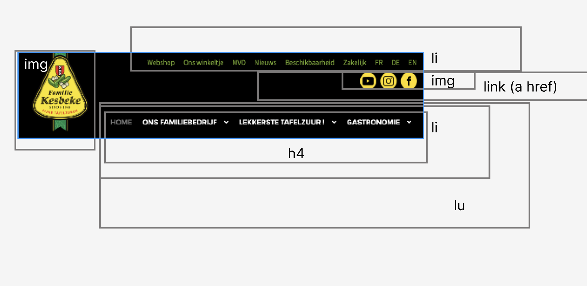
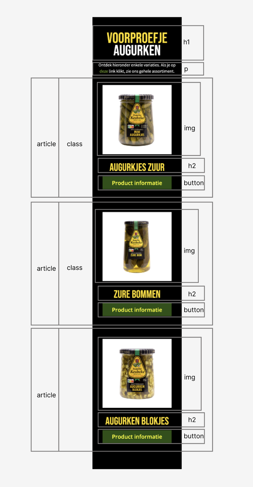
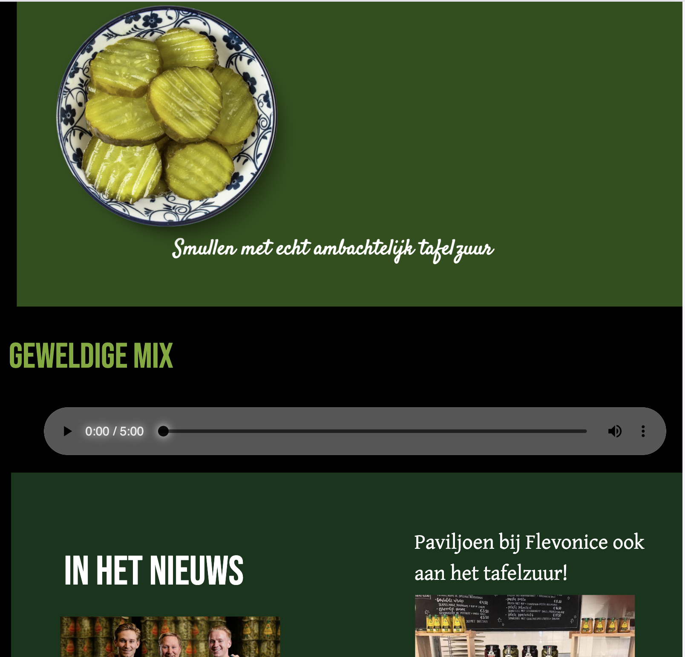
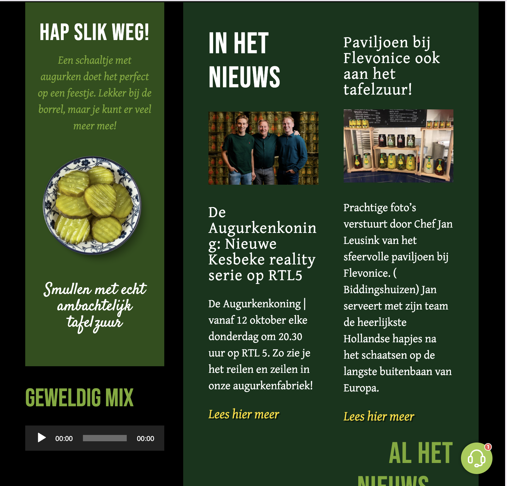

# Procesverslag
Markdown is een simpele manier om HTML te schrijven.  
Markdown cheat cheet: [Hulp bij het schrijven van Markdown](https://github.com/adam-p/markdown-here/wiki/Markdown-Cheatsheet).

Nb. De standaardstructuur en de spartaanse opmaak van de README.md zijn helemaal prima. Het gaat om de inhoud van je procesverslag. Besteedt de tijd voor pracht en praal aan je website.

Nb. Door *open* toe te voegen aan een *details* element kun je deze standaard open zetten. Fijn om dat steeds voor de relevante stuk(ken) te doen.

## Jij

  
uitwerken voor kick-off werkgroep

  ### Auteur:
  Luna Verduijn

  #### Je startniveau:
  Blauw/rood

  #### Je focus:
  Responsive
 

## Je website

  
uitwerken voor kick-off werkgroep

  ### Je opdracht:
  [link naar de website die je gaat namaken óf de naam/omschrijving van je eigen ontwerp](https://www.kesbeke.nl/)

  #### Screenshot(s) van de eerste pagina (small screen): 
  hier de naam van de pagina  
  

  #### Screenshot(s) van de tweede pagina (small screen):
  hier de naam van de pagina  
  
 

## Toegankelijkheidstest 1/2 (week 1)

  
uitwerken na test in 2e werkgroep

  ### Bevindingen
  - Er wordt veel gebruik gemaakt van classes.
  - De html is niet semantisch correct.
  - Bij het onderdeel "Headings" is op alles "nee" geantwoord.
  - Niet alle img hebben een alt.
  - Er wordt geen gebruikt gemaakt van list elementen.
  - Er wordt geen a gebruikt voor links.
  - Het button element wordt niet gebruikt voor knoppen.
    

## Breakdownschets (week 1)

  
uitwerken na afloop 3e werkgroep

  ### de hele pagina: 
  

  ### dynamisch budeel (bijv menu): 
  

  ### wellicht nog een dynamisch deel (bijv filter): 
  

## Toegankelijkheidstest 2/2 (week 4)

  
uitwerken na test in 9e werkgroep

  ### Bevindingen
  Verbeterd:
  - Elke img een alt geven.
  - Een button element gebruiken voor knoppen.
  - Het a element gebruiken voor links.
  - List elements gebruikt bijvoorbeeld voor in het navigatiemenu.
  - De heading element correct gebruikt.
    Bevinding:
  - Wat mij opviel is dat als ik de "voice over" aanzet in mijn instellingen en ik naar mijn website ga dat de computer mij goed door de pagina heen kan navigeren.

## Eindgesprek (week 5)

  
uitwerken voor eindgesprek

  ### Je uitkomst - karakteristiek screenshots:
  
  

  ### Dit ging goed/Heb ik geleerd: 
Het maken van de animatie met Javascript voor mijn H1/H2 tekst en img.

  ### Dit was lastig/Is niet gelukt:
  De plaatjes naast elkaar zetten is niet gelukt met behulp van grid of flexbox.

  
  

  Ook de pijltjes voor de carousel is niet gelukt.

## Bronnenlijst

  
continu bijhouden terwijl je werkt

  Nb. Wees specifiek ('css-tricks' als bron is bijv. niet specifiek genoeg). 
  Nb. ChatGpT en andere AI horen er ook bij.
  Nb. Vermeld de bronnen ook in je code.

  1. [CodePen grid](https://codepen.io/shooft/pen/KwdZPMP)
  2. [CodePen Intersection observer, maken van animatie](https://codepen.io/Nienke-the-styleful/pen/zYgYomN)
  3. [ChatGPT](https://chatgpt.com/?model=auto)
  4. [CSS-tricks Text-shadow](https://css-tricks.com/almanac/properties/t/text-shadow/)
  5. [CSS-tricks flexbox](https://css-tricks.com/snippets/css/a-guide-to-flexbox/)
  6. [CSS-tricks details/summary](https://css-tricks.com/using-styling-the-details-element/)
  7. [W3Schools dropdown navigatie menu met java](https://www.w3schools.com/howto/howto_js_dropdown.asp)
  8. [Mdn position absolute](https://developer.mozilla.org/en-US/docs/Web/CSS/position)
  9. [CSS-tricks responsive maken](https://css-tricks.com/almanac/rules/m/media/)
  10.[DLO]

